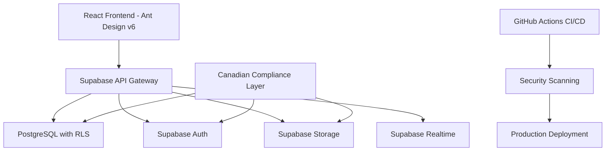

# SwiftBooks System Architecture
## Canadian SMB Accounting Software - Security-First Design

### Architecture Overview
SwiftBooks follows a modern, security-first architecture optimized for Canadian Small and Medium-sized Businesses (SMBs) with strict compliance requirements.

### Technology Stack Rationale

#### Frontend: React 18+ with Ant Design v6
- **Security**: Enterprise-grade components with built-in security features
- **Accessibility**: WCAG 2.1 compliance out of the box
- **Internationalization**: Robust bilingual support for Canadian requirements
- **Performance**: Optimized for financial application workflows

#### Backend: Supabase PostgreSQL
- **Security**: Row-Level Security (RLS) for multi-tenant isolation
- **Compliance**: Canadian data residency and privacy requirements
- **Real-time**: Live collaboration for accounting teams
- **Audit**: Immutable audit trails for financial regulations

#### DevOps: GitHub Actions + Security Automation
- **Security**: Automated vulnerability scanning and compliance checking
- **Quality**: Comprehensive testing and code quality gates
- **Deployment**: Blue-green deployment with automatic rollback
- **Monitoring**: Real-time security and performance monitoring

### Security Architecture Principles

1. **Defense in Depth**: Multiple security layers from frontend to database
2. **Zero Trust**: All access requires authentication and authorization
3. **Data Encryption**: End-to-end encryption for all sensitive data
4. **Audit Everything**: Comprehensive logging for compliance requirements
5. **Canadian Compliance**: Built-in compliance with Canadian regulations

### Database Architecture

#### Multi-Tenant Isolation Strategy
- Row-Level Security (RLS) policies for company data isolation
- Encrypted sensitive data at column level
- Audit trails for all financial operations
- Real-time subscriptions with security validation

#### Canadian Compliance Schema
- Chart of accounts following Canadian accounting standards
- Tax calculation tables for federal and provincial requirements
- CRA integration preparation with proper data structures
- FINTRAC compliance reporting capabilities

### Performance and Scalability

#### Target Performance Metrics
- Page load time: < 2 seconds (95th percentile)
- API response time: < 500ms average
- Database queries: < 100ms for financial calculations
- Real-time updates: < 100ms latency

#### Scalability Design
- Horizontal scaling through Supabase infrastructure
- Efficient database indexing for financial queries
- CDN integration for global performance
- Auto-scaling based on usage patterns

### Development and Deployment

#### CI/CD Pipeline Security Gates
1. **Code Quality**: ESLint, TypeScript compilation, test coverage
2. **Security Scanning**: SAST, DAST, dependency vulnerabilities
3. **Performance Testing**: Load testing and performance regression
4. **Compliance Validation**: Canadian regulatory requirement checks
5. **Integration Testing**: End-to-end workflow validation

#### Deployment Strategy
- Blue-green deployment for zero-downtime updates
- Database migration with automatic rollback capabilities
- Feature flags for gradual rollout
- Comprehensive monitoring and alerting

This architecture ensures SwiftBooks meets the highest standards for security, performance, and Canadian regulatory compliance while providing an exceptional user experience for SMB accounting workflows.
